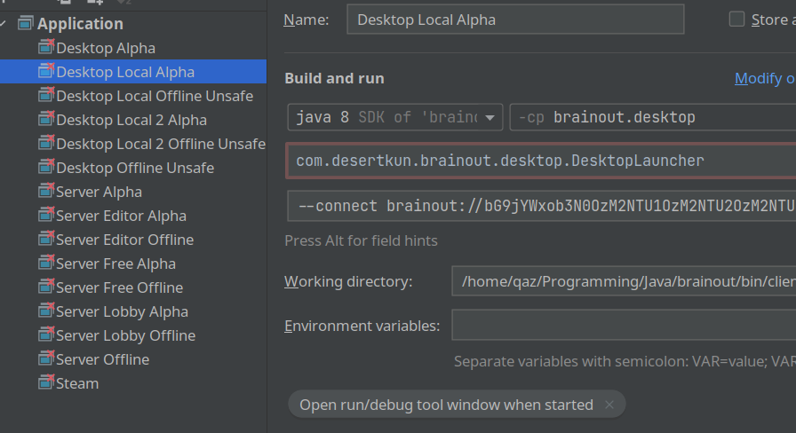

## Run configurations not available

1. Close project
2. Delete `.idea`
3. Run `./gradlew idea` in root folder
4. Open project using `brainout.ipr` file

## Class not found in module



1. Set `brainout.[modulename]` to `brainout.[modulename].main`
2. Repeat with each run configuration.
3. Click `Apply`

## "…dxRuntimeException: Error reading file: mainmenu…"
Make sure you have run the create data script successfully.
Check if all dependencies are installed correctly.

| Platform | Script          |
|----------|-----------------|
| Windows  | `make_data.bat` |
| Linux    | `make_data.sh`  |
| MacOS    | `make_data.sh`  |

## Python Issues
You will need to use Python 2 and the Python 2 version of pip.

## `make_data.py` TypeError
1. Make sure hjson is installed
```shell
pip install git+https://github.com/desertkun/hjson-py
```
2. Make sure that the desurtkun's fork is used instead of the default package if you have that installed already.